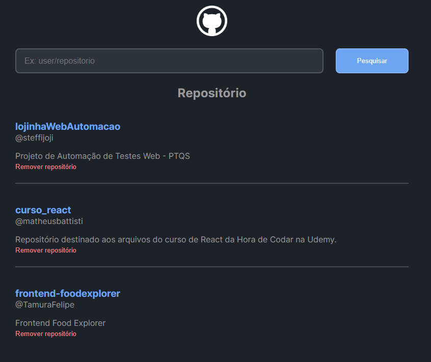

# Wiki Repositórios - React Challenge

This repository contains the code for the Wiki Repositórios challenge, which is part of the React module in the DIO.me training program. The challenge focuses on basic React concepts and utilizes dependencies such as styled-components and axios.

## Introduction

The Wiki Repositórios challenge aims to provide a simple yet functional application where users can search for GitHub repositories and view details about them. The application demonstrates how to use React components, manage state, and interact with APIs to fetch and display data.

## Dependencies

- React: [https://reactjs.org/](https://reactjs.org/)
- styled-components: [https://styled-components.com/](https://styled-components.com/)
- axios: [https://axios-http.com/](https://axios-http.com/)

## Features

- Search for GitHub repositories by user/repository
- View details of the selected repository
- Display repository information, such as name, owner, description, and URL

Feel free to contribute or provide feedback on the project. Happy coding! 🚀